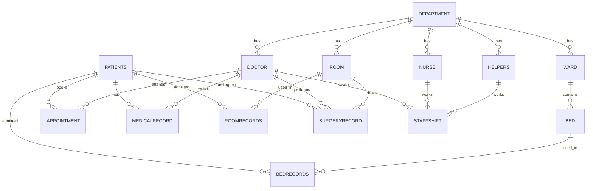

<h1 align="center">🏥 Hospital Management System</h1>
<p align="center"><b>SQL analysis project: 15 business questions answered on a 14-table hospital database</b></p>

<p align="center">
  
  
  
</p>

---

## About the project

A hospital runs on questions like these: *Which beds are free on Saturday? Can we handle a sudden rush of patients? Does this doctor really deserve a raise? Who was in the operating room that night?*

I built a hospital database in MySQL and wrote 15 queries to answer questions like these. Each query starts from a plain-English business problem and ends with a result a manager could act on.

## Quick facts

| | |
|---|---|
| **Database** | MySQL |
| **Tables** | 14 |
| **Queries** | 15 business questions |
| **Areas covered** | Appointments, admissions, bed availability, staff workload, revenue, surgeries |

## Repository files

```
├── Hospital_Management_System_file.sql   # creates the database, tables and data
├── SQL_project.sql                       # all 15 queries
└── README.md
```

## Database design



## Business questions

| # | Question | Main SQL concepts |
|---|---|---|
| 1 | Patients with their appointment doctor and reason | JOIN |
| 2 | Nurses who assisted bed admissions, with patient name | JOIN |
| 3 | Rooms used for surgeries, with surgeon and surgery type | JOIN |
| 4 | Number of doctors in each department | GROUP BY, COUNT |
| 5 | Patients who had an appointment and were admitted to a bed | JOIN |
| 6 | Empty Cardiology beds on a given date | NOT IN subquery |
| 7 | Appointments per department on one day (outbreak planning) | JOIN, GROUP BY |
| 8 | Does a doctor deserve a raise? Monthly workload check | Correlated subqueries |
| 9 | Total revenue for one day | LEFT JOIN, SUM |
| 10 | Patients with more than 4 visits in a year (discount list) | HAVING |
| 11 | Staff present during a specific surgery (anesthesia complaint) | 5-table JOIN |
| 12 | Monthly working hours per staff member vs 200-hour target | UNION ALL, CASE, TIMESTAMPDIFF |
| 13 | Patients with a follow-up due this week | Date filtering |
| 14 | Most used payment method in Super Deluxe rooms | EXISTS, GROUP BY |
| 15 | Percentage of stable patients per surgeon | Conditional aggregation |

## A few queries in detail

<details>
<summary><b>Q6 – Which Cardiology beds are empty on a given day?</b></summary>

A new patient needs a Cardiology bed on a specific date. The query lists every bed in that ward that is not already booked on that day.

```sql
SELECT b.bed_No, b.ward_No
FROM bed b
JOIN ward w ON b.ward_No = w.ward_No
JOIN department d ON d.dept_Id = w.dept_Id
WHERE d.dept_Name = "Cardiology"
  AND b.bed_No NOT IN (
      SELECT br.bed_No
      FROM bedrecords br
      WHERE "2025-03-30" BETWEEN br.admission_Date AND br.discharge_Date
  );
```
</details>

<details>
<summary><b>Q12 – Monthly working hours for doctors, nurses and helpers</b></summary>

Every staff member should work 200 hours a month. Some shifts end after midnight, so the end time is smaller than the start time. The `CASE` handles that by adding 24 hours. I repeated the query for each role and joined the results with `UNION ALL`.

```sql
SUM(
    CASE
        WHEN ss.shift_End < ss.shift_Start
            THEN TIMESTAMPDIFF(HOUR, ss.shift_Start, ss.shift_End) + 24
        ELSE TIMESTAMPDIFF(HOUR, ss.shift_Start, ss.shift_End)
    END
) AS total_hours
```
</details>

<details>
<summary><b>Q15 – How often are each surgeon's patients stable after surgery?</b></summary>

```sql
SELECT d.doct_Id, d.FName,
       COUNT(*) AS total_surgeries,
       SUM(CASE WHEN sr.notes = 'Stable' THEN 1 ELSE 0 END) AS stable_patients,
       ROUND(SUM(CASE WHEN sr.notes = 'Stable' THEN 1 ELSE 0 END) * 100.0 / COUNT(*), 2) AS stable_pct
FROM SurgeryRecord sr
JOIN Doctor d ON d.doct_Id = sr.surgeon_Id
GROUP BY d.doct_Id, d.FName
ORDER BY stable_pct DESC;
```
</details>

## Key findings

> Add 3 or 4 real results from your own output here. Delete this note after.

- Cardiology had **[X]** free beds on 30 March 2025
- **[Department name]** had the most appointments on 4 June 2025
- The most used payment method among Super Deluxe room patients was **[method]**
- **[Surgeon]** had the highest stable-patient rate at **[Z]%**

## Sample output

> Add 2 or 3 screenshots of your query results here, like this: ``

## How to run

1. Open MySQL Workbench.
2. Run `Hospital_Management_System_file.sql` to create the database and load the data.
3. Run `SQL_project.sql` to see the results.

## What I practised

- Joining up to 5 tables in one query
- GROUP BY and HAVING for summaries and filters
- Subqueries: correlated, IN, NOT IN, EXISTS
- CASE WHEN for conditional counts and percentages
- Date and time functions, including shifts that cross midnight
- Turning a business problem into a SQL query

## About me

I'm **[Your Name]**, a B.Pharm graduate from Thane looking for a data analyst role in the pharma industry. I work with Advanced Excel, Power BI, SQL and Python.

🔗 [LinkedIn](your-linkedin-link) &nbsp;|&nbsp; 📧 your-email@example.com
